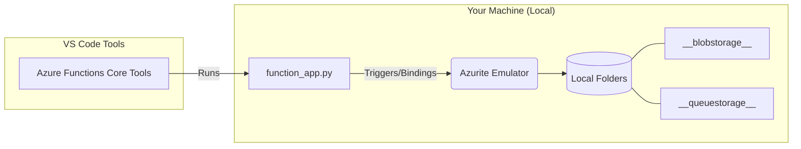

# Learn Azure Function

### Prerequisite

- UV and Python 3.13
- VS Code with extensions: `Azure Functions`, `Azure Resources`, and `Azurite`
- Azure CLI
- Azure Account

### Steps

- Clone this project.
- Create virtual environment, run `uv venv`.
- Install packages, run `uv pip install -r requirements.txt`.
- Start Azurite services (Blob, Queue, Table):
  - Press `Cmd + Shift + P` (or `Ctrl + Shift + P`)
  - Type `Azurite: Start` then press `Enter`
- Press `F5` to start and run the azure function locally

### Local Development Workflow Diagram



### Project Structure

```txt
/
├── __blobstorage__/      # Local Azure Blob Storage (Azurite data)
├── __queuestorage__/     # Local Azure Queue Storage (Azurite data)
├── __azurite_db_*.json   # Azurite metadata and internal state
├── .venv/                # Python virtual environment
├── host.json             # Global configuration for Azure Functions
├── local.settings.json   # Local environment variables & secrets (Excluded from Git)
├── requirements.txt      # Project dependencies (e.g., azure-functions)
└── function_app.py       # Main Entry Point: Azure Functions V2 programming model
```

### Azure CLI exmaples

1. Login via CLI

   ```sh
   az login
   ```

2. Create Resource Group

   ```
   az group create --name rg-learn-webhook --location southeastasia
   ```

3. Delete Resource Group

   ```
   az group delete --name rg-learn-webhook
   ```

### Definitions

| Keyword        | Description                                                                                                                                                                                                                                                                                                        |
| -------------- | ------------------------------------------------------------------------------------------------------------------------------------------------------------------------------------------------------------------------------------------------------------------------------------------------------------------ |
| Resource Group | a 'bucket' or 'folder' used to collect all the services you create—such as Databases, Functions, and Storage—into one place for easy management.                                                                                                                                                                   |
| Azurite        | A Cloud Emulator (simulates the cloud on your local machine). Instead of having to stay connected to the internet to use actual Azure Storage, Azurite simulates Blob, Queue, and Table Storage locally. This allows you to run and test your applications fast and for free, even without an internet connection. |

### Documents:

- [Develop Azure Functions by using Visual Studio Code](https://learn.microsoft.com/en-us/azure/azure-functions/functions-develop-vs-code?tabs=node-v4%2Cpython-v2%2Cisolated-process%2Cquick-create&pivots=programming-language-python)
