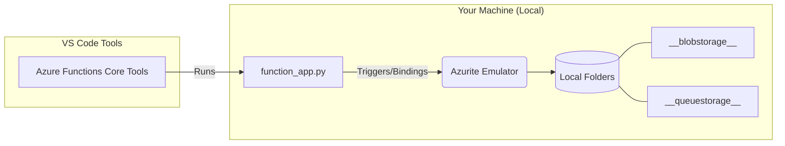

# Learn Azure Function

### Prerequisite

- UV and Python 3.13
- VS Code with extensions: `Azure Functions`, `Azure Resources`, and `Azurite`
- Azure CLI
- Azure Account

### Steps

- Clone this project.
- Create virtual environment, run `uv venv`.
- Install packages, run `uv pip install -r requirements.txt`.
- Start Azurite services (Blob, Queue, Table):
  - Press `Cmd + Shift + P` (or `Ctrl + Shift + P`)
  - Type `Azurite: Start` then press `Enter`
- Press `F5` to start and run the azure function locally

### Local Development Workflow Diagram



### Project Structure

```txt
/
├── __blobstorage__/      # Local Azure Blob Storage (Azurite data)
├── __queuestorage__/     # Local Azure Queue Storage (Azurite data)
├── __azurite_db_*.json   # Azurite metadata and internal state
├── .venv/                # Python virtual environment
├── host.json             # Global configuration for Azure Functions
├── local.settings.json   # Local environment variables & secrets (Excluded from Git)
├── requirements.txt      # Project dependencies (e.g., azure-functions)
└── function_app.py       # Main Entry Point: Azure Functions V2 programming model
```

---

### Azure CLI exmaples

**Login via CLI**

```sh
az login
```

**Create Resource Group**

```sh
az group create --name rg-learn-webhook --location southeastasia
```

**Delete Resource Group**

```sh
az group delete --name rg-learn-webhook
```

**Create a Storage Account (Real version of Azurite)**

_Note: `--name` must be globally unique, lowercase, no symbols._

```sh
az storage account create \
  --name gamelearnwebhook \
  --location southeastasia \
  --resource-group rg-learn-webhook \
  --sku Standard_LRS
```

**Create the Function App**

```sh
az functionapp create \
  --name game-learn-webhook \
  --resource-group rg-learn-webhook \
  --storage-account gamelearnwebhook \
  --flexconsumption-location southeastasia \
  --runtime python \
  --runtime-version 3.13 \
  --instance-memory 2048
```

**Delete the Function App**

```sh
az functionapp delete \
  --name func-learn-game \
  --resource-group rg-learn-webhook
```

**List the Function App Service Plan**
```sh
az functionapp plan list \
  --resource-group rg-learn-webhook \
  --output table
```

**Delete the Function App Service Plan**
```sh
az functionapp plan delete \
  --name <YOUR_PLAN_NAME> \
  --resource-group rg-learn-webhook \
  --yes
```

**Deploy the Function App**

```sh
func azure functionapp \
  publish game-learn-webhook \
  --build remote
```

**Stream the Function App Logs**

```sh
func azure functionapp \
  logstream game-learn-webhook
```

**Set the Function App Environment Variables**
```sh
az functionapp config appsettings set \
  --name game-learn-webhook
  --resource-group rg-learn-webhook
  --settings MY_API_KEY=12345
```

---

### Definitions

| Keyword        | Description                                                                                                                                                                                                                                                                                                        |
| -------------- | ------------------------------------------------------------------------------------------------------------------------------------------------------------------------------------------------------------------------------------------------------------------------------------------------------------------ |
| Resource Group | a 'bucket' or 'folder' used to collect all the services you create—such as Databases, Functions, and Storage—into one place for easy management.                                                                                                                                                                   |
| Azurite        | A Cloud Emulator (simulates the cloud on your local machine). Instead of having to stay connected to the internet to use actual Azure Storage, Azurite simulates Blob, Queue, and Table Storage locally. This allows you to run and test your applications fast and for free, even without an internet connection. |

### Documents:

- [Azure CLI](https://aka.ms/cli_ref)
- [Develop Azure Functions by using Visual Studio Code](https://learn.microsoft.com/en-us/azure/azure-functions/functions-develop-vs-code?tabs=node-v4%2Cpython-v2%2Cisolated-process%2Cquick-create&pivots=programming-language-python)
